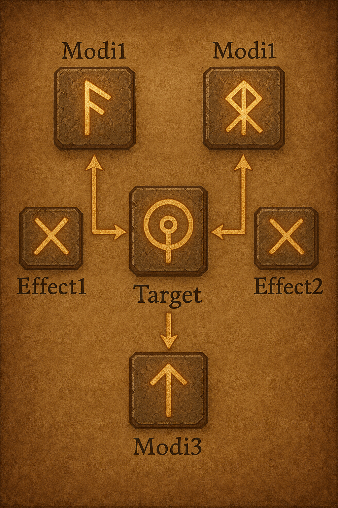

# RuneCollection
Collection of runes for our magic system

## How to build a rune setup

To build a rune setup, follow these rules:

1. **Start with a targeting rune**: Every setup begins with a targeting rune, such as Entity or Projectile.
2. **Extend with modifiers and effects**: After the targeting rune, you can add modifiers (like Targets, Range, Count) to change its behavior, or attach effect runes (such as Area).
3. **Expand effects with modifiers**: Effect runes can also be modified, but their modifiers will alter the effect itself (e.g., Fire adds damage, Range increases area size).
4. **Read rune dynamics below**: The specific impact of each modifier and effect is described in the following sections of this document.

```
             |-------|              |-------|
             | Modi1 |              | Modi1 |
             |-------|              |-------|
                 ^                      ^
|--------|  |--------|  |--------|  |--------|  |-------|
|  Modi2 |< |Effect1 |< | Target | >|Effect2 | >| Modi2 |
|--------|  |--------|  |--------|  |--------|  |-------|  
                 v                      v
             |-------|              |-------|
             | Modi3 |              | Modi3 |
             |-------|              |-------|                 
```

---
### Target runes

#### Self

> Centered at yourself

#### Touch

> Centers the point you have touched with one of your hands

##### Modifiers

- Trigger: Whatever you touch will be effected by your spell once someone interacts with that object/entity
- Grand delay: Staggers the spell by an extra hour
- Minor delay: Staggers the spell by an extra minute

#### Entity

> Targets a single creature within range

##### Modifiers

- Targets: Increases the number of targets by 1
- Range: Increases the targeting range by 10ft

#### Projectile

> Can be shot in any direction, projectile dies when reaching max range

##### Modifiers

- Count: Increases the number of target by 1
- Range: Increases the targeting range by 10ft

---
### Effect runes

#### Area

> Creates an area around spell invocation

##### Modifiers

- Fire: Sets area on fire, dealing  d4 + 1 fire damage 
- Range: Increases radius of area by 2 ft

#### Explosion

> Creates a blast that radiates outward from the target point

##### Modifiers

- Fire: Adds fire damage equal to  d6 + 2
- Git push: Pushes creatures 10ft away
- Git pull: Pushes creatures 10ft towards the center
- Merge conflict: Inflicts d8 psychic damage
- Range: Increases explosion radius by 5 ft
- Intensity: Increases damage dice by one step (d4→d6→d8→d10→d12)

#### Enchantment runes

> Applies a magical effect of type _ to target(s), with a save of _ and a duration of _. The target can make the save to break free every turn. 

##### Sub runes

- Charm: Target must make Wisdom save or be charmed for 1 minute (base)
- Fear: Target must make Wisdom save or be frightened for 1 minute (base)
- Sleep: Target must make Constitution save or fall unconscious for 1 minute (base)
- Slow: Target's speed is halved for 1 minute (base) and can only take one action per turn

##### Modifiers

- Saves++: +1 to the save dc
- Duration: increases duration by 20%, or at least one full round

#### Conjuration

> Creates temporary magical constructs or summons

##### Modifiers

- Wall: Creates a barrier that blocks movement and line of sight
- Weapon: Summons a spectral weapon that attacks independently
- Creature: Summons a temporary ally to fight alongside the caster
- Duration: Increases effect duration by 1 minute

---
## Example Spells

### Fireball

Using the rune system above, here's how to recreate the classic fireball spell:

**Rune Setup**: `Projectile` → `Explosion` → `Fire` + `Range`

**How it works**:
1. **Projectile** (Target): Launches in a direction, travels until it hits something or reaches max range
2. **Explosion** (Effect): Creates a blast that radiates outward from impact point
3. **Fire** (Modifier): Adds fire damage ( d6 + 2) and potential burning effects
4. **Range** (Modifier): Increases explosion radius by 5 ft for better area coverage

**Alternative Builds**:
- `Projectile` + `Count` → `Explosion` → `Fire` + `Intensity` = Multiple smaller fireballs
- `Entity` → `Explosion` → `Fire` + `Force` = Touch-range fireball that also pushes enemies
- `Projectile` → `Area` → `Fire` + `Range` = Creates a lingering fire zone instead of instant explosion
- `Self` + `Area` → `Explosion` + `Force` + `Intensity` + `Fire` = Kamikaze
